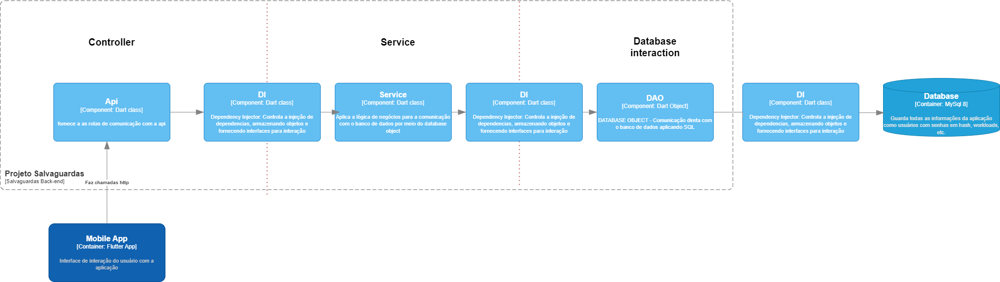

# Arquitetura do Back-End baseada em camadas

A arquitetura se baseia na interação entre três camadas: Controller, Service e Database Interaction. Toda funcionalidade como autenticação, cadastro de usuário, inserção de workload, etc... segue a mesma lógica de organização de camadas

Toda funcionalidade segue um mesmo padrão, possuindo três camadas, que se comunicam com o auxílio do DI, são elas:
- Controller: a única responsabilidade é tratar requisições, recebe chamadas http do front-end, encaminha os dados da Request para o Service e retorna o Response para o cliente

- Service: possui toda lógica de negócios do serviço do qual é responsável, interage com o banco de dados por meio das abstrações fornecidas por um DAO

- Database Interaction: camada responsável pela interação direta com o banco de dados por meio de comandos SQL, fornece abstrações para que um service se preocupe apenas com a lógica de negócios

- DI: Dependency Injector, é uma classe que controla a injeção de dependencias na aplicação, podemos cadastrar objetos que podem ser resgatados a qualquer momento para o uso a partir de sua interface, reduzindo a quantidade de instâncias produzidas e facilitando a aplicação do padrão singleton, o que deixa o código mais simples, legível e escalável