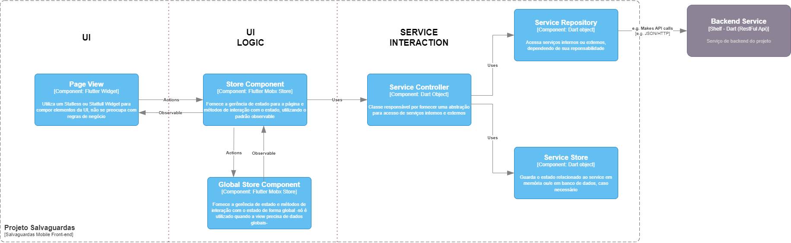

# Arquitetura do Front-End baseada em camadas

A arquitetura se baseia na interação entre três camadas: UI, UI Logic e Service Interaction, como o descrito pelo diagrama

As páginas serão construídas com base no padrão Mobx para gerência de estado, cada page view (responsável apenas pela renderização da interface) pode possuir uma ou mais classes para controlar a sua lógica (Store Component). Regras de negócios devem ser modularizadas/isoladas e servidas com alta abstração a partir de um Service Controller, responsável por controlar instâncias do repository (comunicação com backend ou serviço complexo) e store (guarda, se necessário, os estados do serviço).
